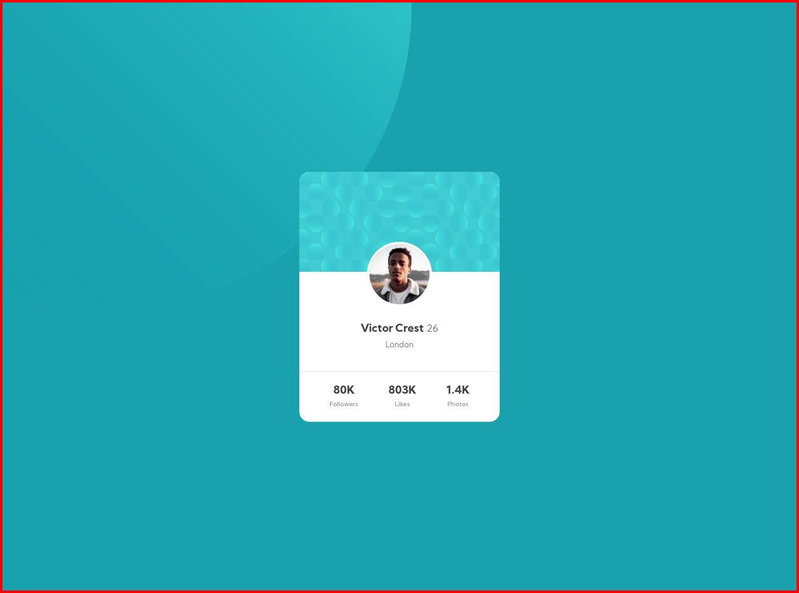
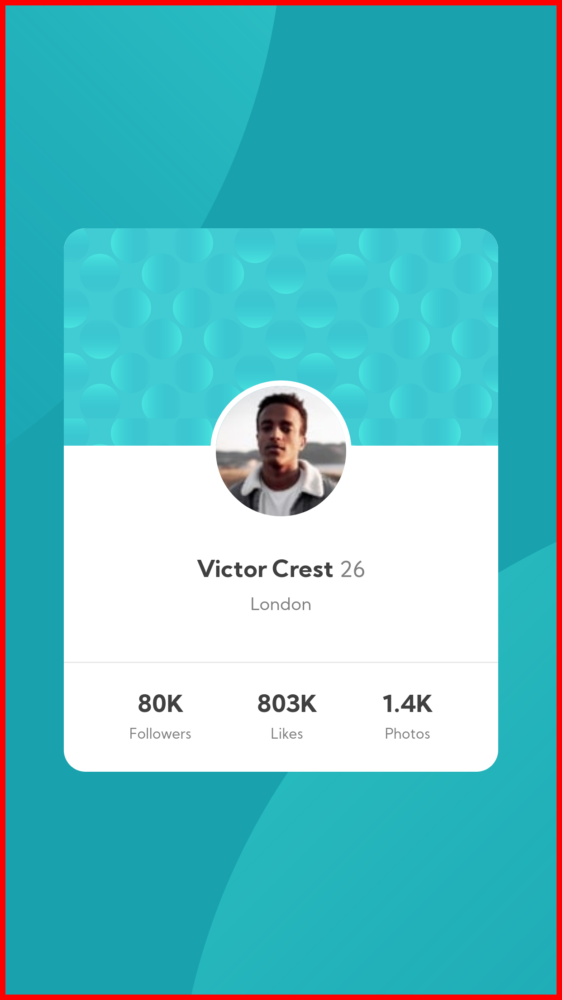

# Frontend Mentor - Profile card component solution

This is a solution to the [Profile card component challenge on Frontend Mentor](https://www.frontendmentor.io/challenges/profile-card-component-cfArpWshJ). Frontend Mentor challenges help you improve your coding skills by building realistic projects. 

## Table of contents

- [Overview](#overview)
  - [The challenge](#the-challenge)
  - [Screenshot](#screenshot)
  - [Links](#links)
- [My process](#my-process)
  - [Built with](#built-with)
  - [What I learned](#what-i-learned)
  - [Continued development](#continued-development)
  - [Useful resources](#useful-resources)
- [Author](#author)
- [Acknowledgments](#acknowledgments)

**Note: Delete this note and update the table of contents based on what sections you keep.**

## Overview

### The challenge

- Build out the project to the designs provided

### Screenshot

- 
- 

### Links

- Solution URL: [Add solution URL here](https://your-solution-url.com)
- Live Site URL: [Add live site URL here](https://your-live-site-url.com)

## My process

### Built with

- Semantic HTML5 markup
- CSS custom properties
- Flexbox
- Mobile-first workflow

### What I learned

This challenge allowed me to be familiar with adding SVGs to the HTML pages.
This also helped me in thinking about how to align the elements properly.

```html
<h1>Some HTML code I'm proud of</h1>
```
```css
body {
    background-color: hsl(185, 75%, 39%);
    background-image: 
        url('images/bg-pattern-top.svg'),
        url('images/bg-pattern-bottom.svg');
    background-position: top -35rem left -48rem, top 22rem left 8rem;
    background-repeat: no-repeat;
}
```

### Continued development

Use this section to outline areas that you want to continue focusing on in future projects. These could be concepts you're still not completely comfortable with or techniques you found useful that you want to refine and perfect.

**Note: Delete this note and the content within this section and replace with your own plans for continued development.**

### Useful resources

- [Kevin Powell's Youtube Channel](https://www.youtube.com/kepowob/featured) - Kevin Powell's YouTube videos cleared a lot of my doubts and provided me with ideas for this challenge.

## Author

- Frontend Mentor - [@VikhyatSharma17](https://www.frontendmentor.io/profile/VikhyatSharma17)
- Twitter - [@Vikhyat1701](https://twitter.com/Vikhyat1701)
